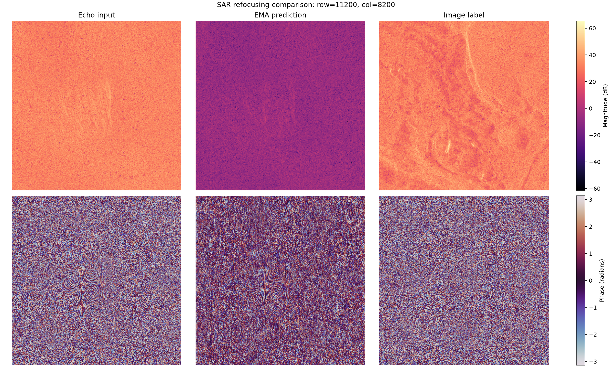
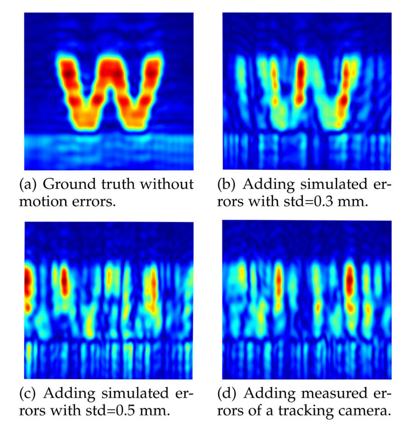

# SwinIR-SAR 散焦重聚焦项目中期评估

> 评估日期：2026-08-11  
> 评估对象：`sar_baseline_v1` 的 EMA best checkpoint（global step 5000）  
> 结论范围：当前数据、训练目标、验证/测试指标和可视化结果，不代表对 SwinIR 或学习式 SAR 重聚焦方法的最终否定。

## 1. 中期结论

当前项目已经完成了数据读取、空间划分、训练、验证、checkpoint 保存、独立测试及结果可视化等工程链路，但**当前 checkpoint 尚未有效完成 SAR 散焦图像重聚焦任务**。

测试报告显示模型相对于直接输出 Echo 的基线具有约 29%～31% 的误差下降，但可视化结果表明模型输出的幅度被系统性压低，标签中的目标、纹理和轮廓没有得到可靠恢复。现有数值改善更可能来自逐复数像素损失下的低能量退化解，而不是来自真正的聚焦能力。

因此，目前最准确的阶段性判断是：

- 工程流程已经跑通；
- 当前 checkpoint 的重聚焦效果不合格；
- 现有测试指标不足以证明重聚焦成功；
- 数据配对、物理成像关系和损失函数需要优先复核；
- 目前还不能据此判定 SwinIR 架构本身绝对不可行，但直接套用通用图像恢复范式的依据不足。

## 2. 当前任务定义

模型把每个 `512 × 512` 复数 SAR patch 表示为实部和虚部两个通道：

```text
Echo complex patch
        ↓ real / imaginary channels
[B, 2, 512, 512]
        ↓ SwinIR
[B, 2, 512, 512]
        ↓
Image complex patch
```

每个配对样本使用当前 Echo patch 的复数 RMS 同时归一化 Echo 和 Image，模型通过复数 Charbonnier loss 学习逐像素映射。训练数据来自：

```text
/data/dyn/capella/output/echo
/data/dyn/capella/output/image
```

测试和本次可视化使用：

```text
/data/dyn/capella/output/echo_3
/data/dyn/capella/output/image_3
```

## 3. 测试结果

测试使用 global step 5000 的 EMA 权重。训练配置计划运行 150,000 steps，因此该 checkpoint 仅处于计划训练进度的约 3.3%。当前本地材料没有完整训练/验证曲线，尚无法证明模型已经收敛。

| 评估集合 | 数量 | 模型 Charbonnier | Echo 基线 | 相对改善 | 模型复数 RMSE | Echo 基线 | 相对改善 |
| --- | ---: | ---: | ---: | ---: | ---: | ---: | ---: |
| 全测试集 | 16,675 | 0.8458 | 1.2280 | 31.13% | 0.7133 | 1.0057 | 29.08% |
| 非重叠子集 | 500 | 0.8431 | 1.2268 | 31.27% | 0.7109 | 1.0041 | 29.20% |

全测试集与 500 个相互不重叠 patch 的指标几乎一致，说明数值改善不是由测试 patch 大量重叠和重复计权单独造成的。不过，该子集只保证测试样本彼此不重叠，并未自动证明测试数据与训练数据在原始场景范围内完全无重叠。

## 4. 可视化观察

下面是 `echo_3/image_3` 中固定随机种子抽取样本的代表性结果。上排依次显示 Echo、EMA prediction 和 Image label 的对数幅度，下排显示相位；同一幅度行共享色标。



从该样本及其他随机样本中可以观察到：

1. Image 标签中能够辨认出细微的区域纹理、线状轮廓和散射结构；
2. Echo 的幅度图更接近无规律散斑，难以找到与标签稳定对应的局部结构；
3. 预测幅度整体比 Echo 和标签低数十 dB；
4. 预测没有可靠复现标签中的主要纹理和轮廓；
5. 预测相位仍带有部分 Echo 的条纹特征，与标签相位分布不一致。

因此，从视觉结果判断，当前模型并没有实现有意义的重聚焦。其主要行为更接近压低输出能量。

## 5. 为什么误差下降不等于重聚焦成功

当前归一化使每个 Echo 的复数 RMS 约为 1。若 Echo 与标签在复数像素层面缺少稳定对应，逐像素损失会遇到相互冲突的监督信号。不同可能标签的实部和虚部在求平均时容易相互抵消，模型最终可能学到接近零的条件均值或中位数。

对于复数 RMS 约为 1 的标签，全零预测的双通道 RMSE 可能接近：

$$
\operatorname{RMSE}(0,Y) \approx \frac{1}{\sqrt{2}} \approx 0.707.
$$

当前非重叠测试子集的模型 RMSE 为 `0.7109`，与该数量级非常接近；结合预测幅度显著衰减的可视化结果，可以合理怀疑当前数值改善主要来自低能量退化解。

这意味着现有 Echo identity baseline 不够充分。后续测试必须增加全零输出、固定增益 Echo 和简单线性滤波等基线，才能判断模型是否真正学习到了结构信息。

## 6. 数据配对风险

原始训练数据审计虽然确认了 Echo 与 Image 的文件名、坐标、矩阵尺寸和复数格式能够严格配对，但内容统计显示二者的像素对应性很弱：

| 数据审计指标 | 结果 |
| --- | ---: |
| 复数相关性均值（3,000 对） | 0.0371 |
| 复数相关性中位数 | 0.0246 |
| 幅度相关性均值（3,000 对） | 0.0681 |
| 幅度相关性中位数 | 0.0171 |
| 平移对齐相关性中位数（200 对） | 0.0467 |

这些结果与可视化中“标签存在结构、Echo 接近散斑”的观察一致。文件名相同只能证明数据在清单层面配对，不能证明两者满足同一像素网格、同一相位基准和统一物理退化过程。

需要进一步确认：

- Echo 和 Image 是否来自同一份原始回波与同一场景；
- 两者分别经过了哪些成像、运动补偿和坐标变换；
- 是否存在平移、翻转、旋转、尺度差异或裁剪起点偏差；
- 是否存在复数全局相位差、二维相位斜坡或不同相位参考；
- patch 是在完整孔径聚焦后切分，还是在聚焦之前切分；
- 完成重聚焦是否需要 patch 之外的孔径或频域上下文。

## 7. 与 IFNet 的对照

IFNet 论文研究的是手持毫米波 SAR 中由轨迹误差造成的相位破坏。论文首先使用运动控制器采集无相位误差的理想 SAR 信号，然后将模拟轨迹误差或实际跟踪相机测得的误差施加到同一组数据上，生成散焦输入。



*图片来源：[IFNet: Deep Imaging and Focusing for Handheld SAR with Millimeter-wave Signals](https://arxiv.org/abs/2405.02023)，用于本项目方法分析。*

图中散焦后的字母 `W` 虽然发生拉伸、分裂和模糊，但目标的位置和主要结构仍与 ground truth 对应。更重要的是，散焦图与 ground truth 不是任意配对，而是满足明确的前向模型：

$$
X_{\text{defocus}} = \mathcal{D}_{\phi}(Y_{\text{focus}}),
$$

其中 $\phi$ 表示运动造成的相位误差。这使问题具有明确的因果关系和可逆目标。

IFNet 与当前实验的关键差异如下：

| 方面 | IFNet | 当前 SwinIR 实验 |
| --- | --- | --- |
| 输入与标签 | 同一信号、同一场景、同一坐标系 | 目前只确认文件名和坐标配对 |
| 散焦来源 | 对理想信号施加模拟或实测相位误差 | Echo 与 Image 的统一退化模型尚未确认 |
| 结构对应 | 扭曲后仍保留可识别目标对应 | 幅度与复数相关性很低 |
| 输入表示 | 复数实部/虚部双通道 | 复数实部/虚部双通道 |
| 网络机制 | 深度展开，显式包含 RMA、逆 RMA、FFT 和相位补偿 | 通用局部窗口图像恢复 |
| 学习目标 | 交替更新图像和相位补偿因子 | 直接逐像素回归最终复数图像 |
| 物理约束 | 输出需要与信号生成模型一致 | 低能量输出也可能降低损失 |

因此，IFNet 的良好结果确实与严格配对和较强结构对应有关，但不应把原因仅归结为“图像看起来相似”。更根本的原因是：它的数据满足已知物理退化模型，网络也显式利用了该模型。

IFNet 面向手持毫米波近场 SAR，而本项目的数据来源和成像模式可能不同，因此不能未经推导直接照搬其网络。真正值得借鉴的是以下原则：

1. 从同一理想信号构造严格配对的散焦输入与聚焦标签；
2. 明确散焦由何种相位误差或成像算子产生；
3. 让网络估计相位误差或补偿因子；
4. 通过物理成像算子生成最终图像；
5. 用结构和聚焦指标评价结果，而不只使用逐复数像素误差。

## 8. 下一阶段建议

### 8.1 第一优先级：确认任务是否成立

1. 从一份 Image 或理想回波出发，施加已知相位误差，生成严格对应的散焦 Echo；
2. 在 1、4、10 个严格配对样本上进行过拟合实验；
3. 检查 Echo/Image 的二维 FFT、互功率谱、复数相干性和相位差；
4. 在整幅场景上完成配准和相位校准后，再按相同窗口切分 patch。

若模型无法过拟合单个严格配对样本，应优先检查实现、归一化、损失和网络表示；若能过拟合但不能泛化，则说明相位误差分布或样本间变换缺少一致性。

### 8.2 第二优先级：修正评价体系

测试报告至少应增加：

- 全零预测基线；
- 最优固定复数增益 Echo 基线；
- 输出/标签 RMS 比和能量偏差；
- 幅度相关性与复数相干性；
- 幅度 PSNR、SSIM 或多尺度结构指标；
- 对点目标的主瓣宽度、PSLR 和 ISLR；
- SAR 聚焦常用的熵、对比度和锐度指标。

选择 best checkpoint 时也需要使用能够排除低能量塌缩的组合指标。

### 8.3 第三优先级：决定模型路线

如果校准后的 Echo 和 Image 具有稳定的空间对应，SwinIR 可以继续作为纯数据驱动基线，但应考虑幅度、相位、频域和结构组合损失。

如果输入实质上是需要全孔径相干处理的原始或粗聚焦 SAR 数据，则应优先考虑：

- 估计相位误差或运动参数，而不是直接生成标签；
- 在频域执行相位补偿；
- 将 PFA、BPA、RMA 或项目实际成像算子嵌入深度展开网络；
- 保留完整孔径或提供足够的全局上下文；
- 使用物理一致性损失约束预测结果。

## 9. 阶段性验收标准

下一阶段只有同时满足以下条件，才能认为模型初步具备重聚焦能力：

1. 明显优于全零输出和线性基线，而不只是优于 Echo identity；
2. 输出与标签的 RMS 比接近 1，不存在系统性能量塌缩；
3. 可视化能够在相同位置恢复标签中的主要轮廓和散射结构；
4. 幅度相关性、复数相干性及聚焦指标同步改善；
5. 在严格空间隔离的独立测试场景上仍保持改善；
6. 训练曲线、验证曲线和多阶段 checkpoint 可视化显示稳定收敛。

## 10. 总结

当前实验揭示了一个比“训练步数不足”更重要的问题：**SAR 重聚焦不能仅作为普通图像到图像恢复任务处理，而必须先确认输入和标签之间是否存在稳定、可识别并且物理合理的映射。**

现有模型的误差下降与视觉失败并不矛盾。低相关性的复数监督使模型倾向于压低输出能量，从而获得较低的逐像素误差。IFNet 的成功说明，严格同源的数据构造、明确的相位误差模型和物理展开网络是该类任务取得可靠结果的关键条件。

项目下一阶段应优先完成数据生成链核查、严格配对实验、零输出基线和小样本过拟合，而不是直接扩大网络或延长训练。只有在任务可识别性得到确认后，比较 SwinIR、IFNet 风格深度展开或其他架构才具有实际意义。
